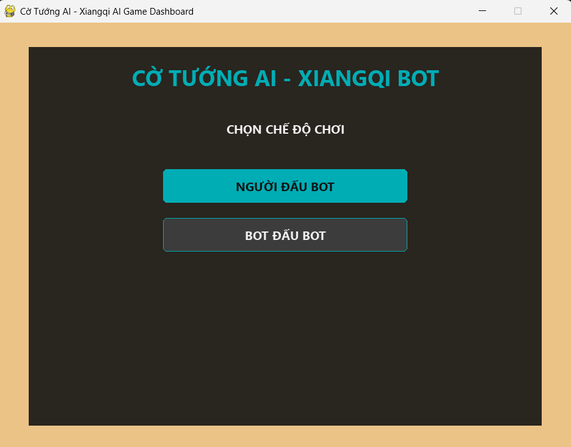
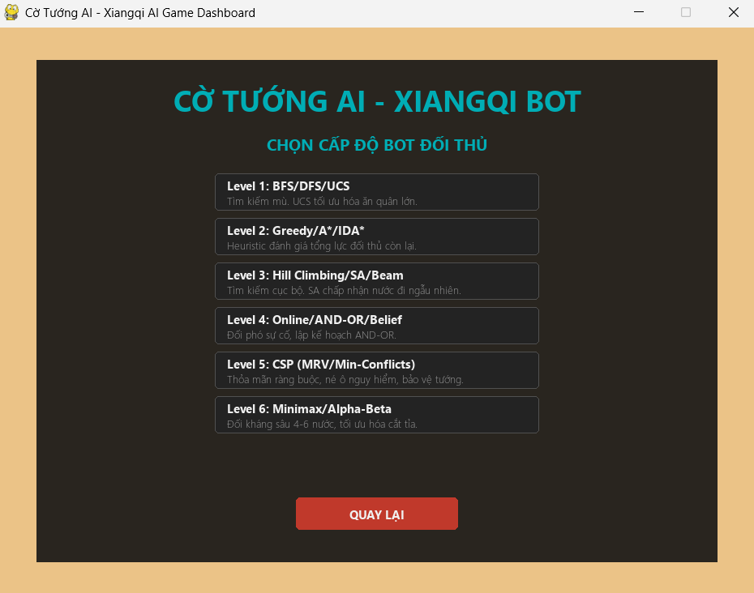
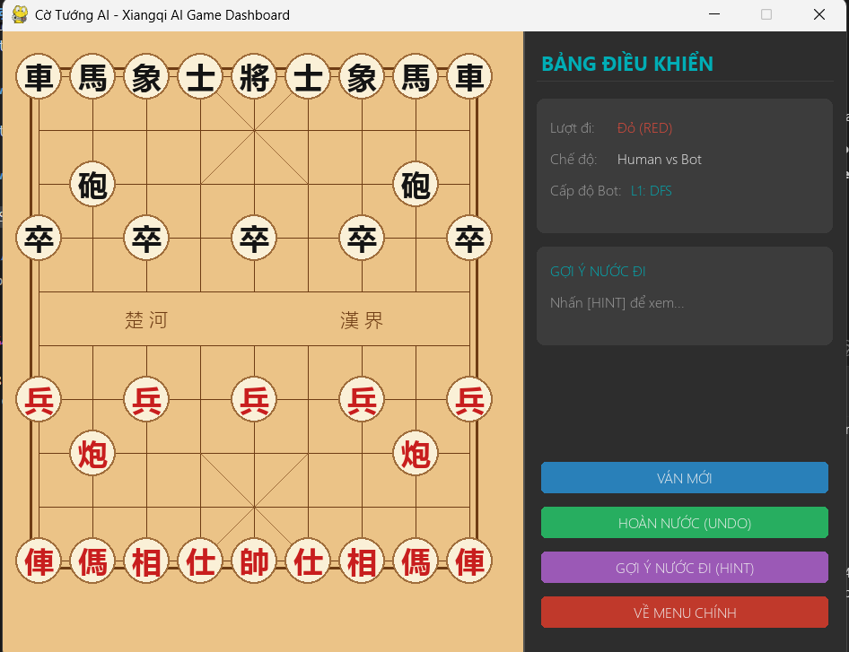

# Cờ Tướng AI - Xiangqi AI Game

> **Đồ án môn học:** Trí tuệ nhân tạo (HK2 - Năm học 2026–2027)  
> **Đơn vị đào tạo:** Đại học Sư Phạm Kỹ Thuật TP.HCM (HCMUTE)  
> **Giảng viên hướng dẫn:** TS. Phan Thị Huyền Trang  
> **Nhóm sinh viên thực hiện:** Nhóm 1 - Cờ tướng 6 level


---

## Thành viên nhóm

| Họ và Tên | Mã Sinh Viên | Liên hệ (Email) |
| :--- | :--- | :--- |
| Lương Viết Vĩ Đông | 24110202 | 24110202@student.hcmute.edu.vn |
| Trần Lê Thái | 24110331 | 24110331@student.hcmute.edu.vn |
| Nguyễn Minh Trí | 24110359 | 24110359@student.hcmute.edu.vn |

---

## Giới thiệu chung

**Cờ Tướng AI (Xiangqi AI)** là trò chơi cờ tướng ngoại tuyến được phát triển bằng ngôn ngữ **Python** và thư viện đồ họa **Pygame**. Trò chơi tích hợp công cụ AI thông minh hỗ trợ 6 cấp độ đối thủ máy từ cơ bản đến nâng cao, ứng dụng các lớp thuật toán tìm kiếm kinh điển và hiện đại trong Trí tuệ nhân tạo.

---

## Cấu trúc thư mục

```bash
chinese_chess/
├── ai/
│   ├── __init__.py           # Đăng ký và quản lý danh sách thuật toán AI
│   ├── eval.py               # Hàm lượng giá trạng thái bàn cờ (Heuristic evaluation)
│   ├── level1.py             # Bot cấp 1: BFS / DFS / UCS (Tìm kiếm mù)
│   ├── level2.py             # Bot cấp 2: Greedy / A* / IDA* (Tìm kiếm Heuristic)
│   ├── level3.py             # Bot cấp 3: Hill Climbing / Simulated Annealing / Local Beam Search
│   ├── level4.py             # Bot cấp 4: Online Search / AND-OR Search / Belief State Search
│   ├── level5.py             # Bot cấp 5: CSP (Constraint Satisfaction Problem với MRV & Min-Conflicts)
│   └── level6.py             # Bot cấp 6: Minimax kết hợp cắt tỉa đối kháng Alpha-Beta / Expectimax
├── game/
│   ├── board.py              # Xử lý logic bàn cờ, lịch sử nước đi, kiểm tra lặp trạng thái
│   ├── pieces.py             # Định nghĩa quân cờ và luật di chuyển pseudo-legal cho 7 quân cờ
│   └── rules.py              # Xác định trạng thái chiếu tướng (check), chiếu bí (mate), hết nước đi (stalemate)
├── gui/
│   ├── assets.py             # Quản lý tài nguyên, hình ảnh và hệ thống avatar
│   ├── easing.py             # Các hàm nội suy toán học tạo chuyển động (animation) mượt mà
│   ├── menu.py               # Giao diện Menu chính và màn hình chọn thuật toán AI
│   ├── renderer.py           # Vẽ bàn cờ, quân cờ (Hán tự/Latinh), các hiệu ứng gợi ý & chiếu tướng
│   ├── shop.py               # Màn hình Cửa hàng (Kỳ trân dị bảo) mua sắm trang bị, avatar
│   ├── sidebar.py            # Bảng điều khiển bên phải (Combobox chọn AI, thống kê Node, lịch sử)
│   └── sound.py              # Trình quản lý và tổng hợp âm thanh (di chuyển, ăn quân, chiếu tướng)
├── tests/
│   └── test_*.py             # Hệ thống unit test chi tiết kiểm thử TDD từng quân cờ và logic AI
├── docs/
│   ├── doc-for-human.md      # Nhật ký kiểm thử TDD và tài liệu cho lập trình viên
│   └── doc-for-agents        # Tài liệu hướng dẫn tích hợp dành cho AI Agents
├── image_readme/             # Thư mục chứa các ảnh chụp màn hình giới thiệu
├── main.py                   # Điểm khởi chạy chính của trò chơi (Pygame controller)
├── requirements.txt          # Danh sách thư viện phụ thuộc của dự án
└── README.md
```

---

## Các tính năng chính

- **2 Chế độ chơi linh hoạt & Bảng điều khiển thông minh**:
  - **Người đấu Bot (Human vs Bot)**: Người chơi (quân Đỏ) thi đấu với Bot AI (quân Đen) tự chọn thông qua Dropdown box trực quan.
  - **Bot đấu Bot (Bot vs Bot)**: Hai thuật toán AI tự động thi đấu đối đầu với nhau. Bảng điều khiển chia làm 2 Combobox riêng biệt cho phép chọn và đổi chiến thuật độc lập cho cả Bot Đỏ và Bot Đen bất kỳ lúc nào.
- **Hệ thống AI 6 cấp độ (18 Thuật toán)**: Tích hợp các thuật toán tìm kiếm đa dạng từ Tìm kiếm mù, Heuristic, Tìm kiếm cục bộ, Khám phá môi trường, CSP đến Đối kháng chuyên sâu.
- **Tạm dừng AI thông minh (Smart AI Pause)**: Tự động tạm dừng hoạt động của các AI khi người dùng mở danh sách chọn thuật toán, giúp thao tác mượt mà không bị gián đoạn.
- **Giao diện Hoàng Gia (Royal Theme) & Hoạt ảnh (Animation)**: Thiết kế tông màu gỗ đỏ ấm áp kết hợp vàng cổ điển (Antique Gold), tích hợp các hàm easing giúp quân cờ di chuyển mượt mà.
- **Cửa hàng Kỳ Trân Dị Bảo (Shop System)**: Giao diện cửa hàng tích hợp cho phép trang bị avatar, bàn cờ và các vật phẩm độc đáo.
- **Hoàn nước (Undo) & Gợi ý (Hint)**: Cho phép quay lại các nước đi trước đó hoặc tính toán gợi ý nước đi tối ưu tức thời bằng Alpha-Beta.
- **Đa luồng tính toán (Threading)**: AI tính toán hoàn toàn trên luồng nền (background thread), đảm bảo giao diện Pygame đạt FPS cao, không giật lag.
- **Hiệu ứng & Âm thanh**:
  - Âm thanh sinh động tổng hợp trực tiếp bằng mã nguồn (Move, Capture, Check).
  - Tự động hiển thị chữ Hán cổ truyền hoặc ký tự Latin viết tắt tùy chỉnh.
  - Hiệu ứng phát sáng màu đỏ (glow) cảnh báo xung quanh tướng đang bị chiếu.

---

## Chi tiết 6 cấp độ AI

1. **Level 1: BFS / DFS / UCS**
   - Áp dụng các thuật toán tìm kiếm mù (Uninformed Search). UCS được tinh chỉnh để tối ưu hóa việc ăn các quân cờ lớn của đối phương.
2. **Level 2: Greedy / A\* / IDA\***
   - Áp dụng tìm kiếm Heuristic (Informed Search) đánh giá tổng lực đối thủ còn lại để tìm đường đi ngắn nhất đến chiến thắng.
3. **Level 3: Hill Climbing / SA / Beam**
   - Áp dụng thuật toán tìm kiếm cục bộ (Local Search). Trong đó Simulated Annealing (SA) chấp nhận các bước đi ngẫu nhiên dựa trên nhiệt độ để tránh tối ưu cục bộ.
4. **Level 4: Online / AND-OR / Belief**
   - Lập kế hoạch AND-OR đối phó với sự cố và môi trường không chắc chắn, duy trì tập trạng thái Belief.
5. **Level 5: Backtracking / Min-Conflicts / AC-3**
   - Mô hình hóa bàn cờ dưới dạng Bài toán thỏa mãn ràng buộc (Constraint Satisfaction Problem - CSP). Sử dụng Backtracking kết hợp lọc AC-3 (Arc Consistency) và heuristic Min-Conflicts để né tránh các ô bị tấn công, ưu tiên bảo vệ Tướng và tối ưu hóa thế trận.
6. **Level 6: Minimax / Alpha-Beta / Expectimax**
   - Đối kháng chuyên sâu, dự đoán trước 4-6 nước đi tiếp theo kết hợp cắt tỉa Alpha-Beta tối ưu hóa không gian tìm kiếm. Ngoài ra, tích hợp Expectimax để xử lý các nước đi mang tính xác suất hoặc dự đoán hành vi không chắc chắn của đối thủ.

---

## Giao diện ứng dụng

### 1. Menu chính & Lựa chọn chế độ chơi
Người chơi có thể lựa chọn chơi trực tiếp với máy tính (Người đấu Bot) hoặc quan sát hai thuật toán AI so tài với nhau (Bot đấu Bot).



### 2. Chọn cấp độ đối thủ AI
Bảng lựa chọn 6 cấp độ AI tương ứng với các nhóm thuật toán học trên lớp.



### 3. Giao diện bàn cờ trò chơi
Bàn cờ cờ tướng 9x10 truyền thống trực quan, tích hợp bảng điều khiển thông minh bên phải để tương tác các tính năng phụ trợ (Undo, Hint, Reset).



---

## Cài đặt và chạy dự án

### Yêu cầu hệ thống
* Python phiên bản 3.10 trở lên (khuyên dùng Python 3.13)
* Hệ điều hành: Windows, macOS hoặc Linux

### Hướng dẫn cài đặt

**Bước 1: Clone kho lưu trữ về máy**
```bash
git clone https://github.com/lwd7071/chinese_chess.git
cd chinese_chess
```

**Bước 2: Khởi tạo và kích hoạt môi trường ảo (khuyên dùng)**
* **Trên Windows (PowerShell)**:
  ```powershell
  python -m venv venv
  .\venv\Scripts\Activate.ps1
  ```
* **Trên macOS/Linux**:
  ```bash
  python3 -m venv venv
  source venv/bin/activate
  ```

**Bước 3: Cài đặt các thư viện cần thiết**
```bash
pip install -r requirements.txt
```

**Bước 4: Chạy ứng dụng**
```bash
python main.py
```

---

## Liên hệ
* **Giảng viên hướng dẫn**: TS. Phan Thị Huyền Trang
* **Sinh viên thực hiện**: Nhóm 1 - Cờ tướng 6 level (HCMUTE)
* **Kho lưu trữ chính**: https://github.com/lwd7071/chinese_chess
